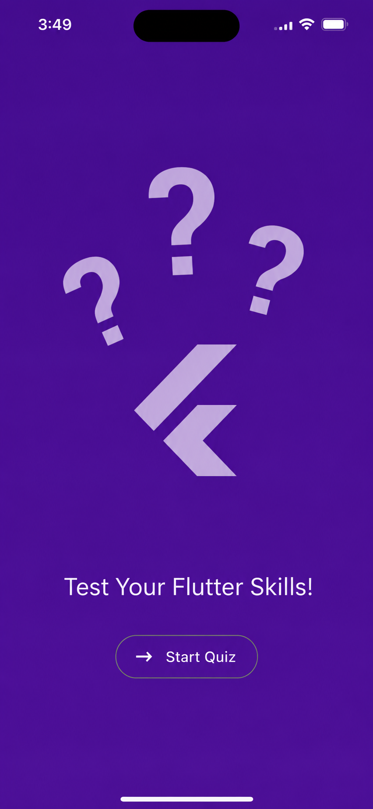
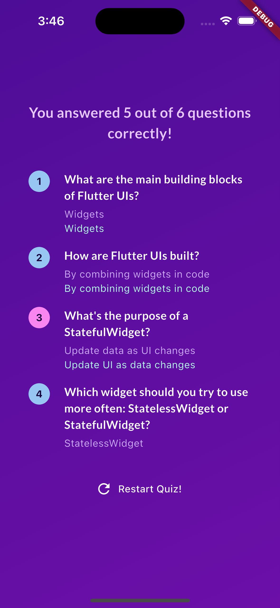
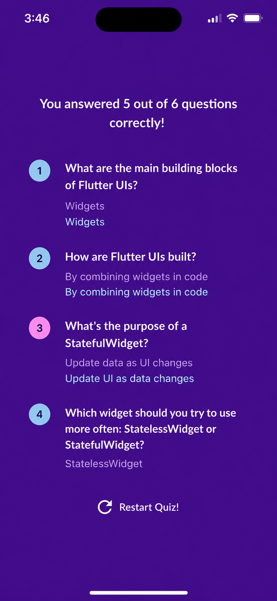

# Quiz App

[](LICENSE)

A learning-focused Flutter quiz application designed for developers who are new to Flutter. The app presents multiple-choice questions, records answers, and shows a results/summary screen. The project is intentionally small and readable so you can explore, modify and extend it while learning Flutter fundamentals.

## Features

- Multiple choice quiz questions
- Results screen with score summary
- Questions summary with per-question feedback
- Lightweight, no backend required (all data bundled locally)

Who this project is for

- Beginners learning Flutter and Dart who want a hands-on example they can extend
- Instructors preparing short lessons or exercises on widgets, state management, and app navigation

What you'll learn

- Basic Flutter app structure (`lib/main.dart`)
- Creating and composing widgets (stateless and stateful)
- Passing data between screens and managing simple state
- Organizing app code and assets
- Running and debugging Flutter apps on devices and web

## Screenshots

App screenshots are stored in `assets/screenshots/`. Below are a few examples; they are included in the repository, so GitHub will render them on the project page.

<table>
  <tr>
    <th>Start</th>
    <th>Question</th>
    <th>Result</th>
  </tr>
  <tr>
    <td align="center"></td>
    <td align="center"></td>
    <td align="center"></td>
  </tr>
</table>

## Quickstart

Prerequisites
- Flutter SDK (stable channel) installed and configured: https://docs.flutter.dev/get-started/install
- A working device/emulator or web browser

Clone and run

```bash
git clone https://github.com/<your-username>/quiz_app.git
cd quiz_app
flutter pub get
flutter run
```

To run on a specific platform:

```bash
flutter run -d chrome      # Web
flutter run -d <deviceId>  # Android/iOS/macOS/etc.
flutter build apk          # Build Android APK
flutter build ios          # Build iOS (macOS required)
```

Project structure (key files)
- `lib/main.dart` - App entrypoint
- `lib/start_screen.dart`, `lib/questions_screen.dart`, `lib/results_screen.dart` - UI screens
- `lib/data/questions.dart` - Local quiz data
- `lib/models/quiz_question.dart` - Question model
- `assets/images/` - App images (logo, screenshots)

Guided walkthrough (recommended order)

1. Run the app locally: `flutter run` and interact with it to see current behavior.
2. Open `lib/main.dart` to see how routes and the app scaffold are configured.
3. Inspect `lib/data/questions.dart` — add one sample question to see how the UI updates.
4. Explore `lib/questions_screen.dart` to understand how user answers are collected and passed to the results screen.
5. Modify a widget's styling (colors, fonts) in `lib/styled_text.dart` and hot-reload to observe changes.
6. Review `lib/questions_summary/summary_item.dart` to learn how the app builds per-question feedback.

Suggested beginner exercises

- Exercise 1 — Add a new question type: include an image with a question and show it in the UI.
- Exercise 2 — Track time per question and display total time on the results screen.
- Exercise 3 — Add persistence: save highest score locally using `shared_preferences`.
- Exercise 4 — Add simple animations when navigating between screens.

Solutions and hints

If you'd like, I can provide step-by-step hints or a branch with example solutions for each exercise — tell me which exercise you'd like help with and I'll add a guided patch or branch.

Testing

This project includes a basic widget test in `test/widget_test.dart`. Run tests with:

```bash
flutter test
```

Contributing

Contributions are welcome. If you'd like to suggest changes or improvements:

1. Fork the repository
2. Create a topic branch (git checkout -b feature/your-feature)
3. Commit and push your changes
4. Open a pull request with a clear description

License

This project is provided under the MIT License — see the `LICENSE` file for details. Replace the copyright holder in `LICENSE` with your name or organization.

Contact

For questions, mention the repository owner or add an issue on GitHub.
